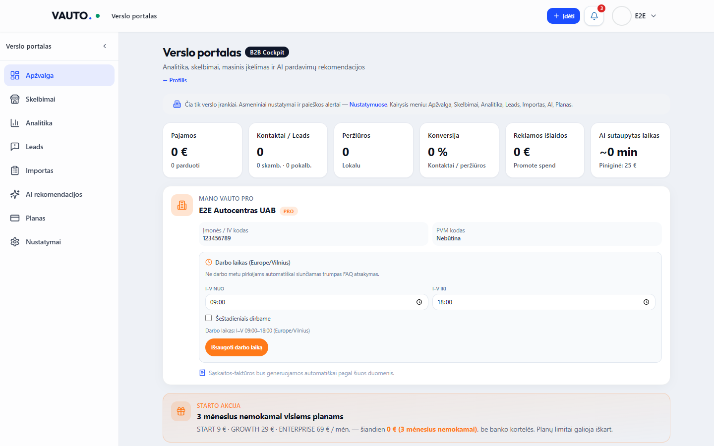
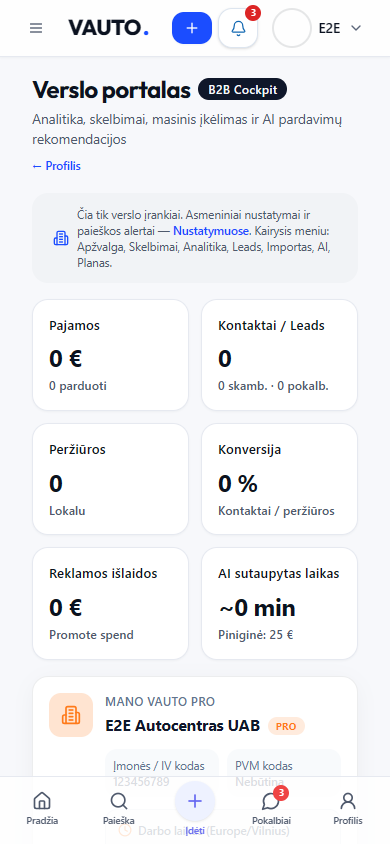

# VAUTO Premium UI 2.0 — Etapas 7: Verslo portalas (Business Cockpit)

**Data:** 2026-08-05  
**Status:** Atlikta

## Santrauka

Verslo portalas (`/verslui`) pertvarkytas į B2B Cockpit 2.0: DS KPI juosta, trendų / efektyvumo vizualizacija, kainos vs mediana, `AiInsightCard` rekomendacijos ir pilnas sujungimas su Etapas 2 B2B sidebar (Apžvalga, Skelbimai, Analitika, Leads, Importas, AI, Planas).

## Pakeitimai

| Modulis | Kelias |
|---------|--------|
| Cockpit overview | `src/components/business/BusinessCockpitOverview.tsx` |
| Portal shell | `src/components/business/BusinessPortalDashboard.tsx` |
| Pro dashboard wiring | `src/components/dashboard/ProBusinessDashboard.tsx` |
| B2B analitikos panelis | `src/components/dashboard/B2BAnalyticsPanel.tsx` |
| B2B sidebar nav | `src/components/app-shell/nav-config.ts` |
| Playwright | `e2e/business-ui-7.0.spec.ts` |

**Neliečiama:** API, Auth, verslo prieigos tikrinimas, DB, mokėjimai / checkout.

## KPI ir analitika

- StatCards: Pajamos · Kontaktai/Leads · Peržiūros · Konversija · Reklamos išlaidos · AI sutaupytas laikas
- Sparkline trendai (peržiūros / kontaktai)
- Kategorijų efektyvumas + kaina prieš rinkos medianą
- AI tipai: kainos virš rinkos, silpnos nuotraukos, publikavimo laikas 19:00

## Sidebar

Sekcijos per `?section=` (`analytics` | `leads` | `import` | `ai` | `plan`) — scroll / tab perjungimas be naujų route’ų.

## QA

| Check | Rezultatas |
|-------|------------|
| `npx tsc --noEmit` | Exit 0 |
| `npm run server:build` | Exit 0 |
| `npm run build` | Exit 0 |
| Playwright `e2e/business-ui-7.0.spec.ts` | **2/2 passed** |

## Screenshot’ai

### Desktop 1440×900

### Mobile 390×844

