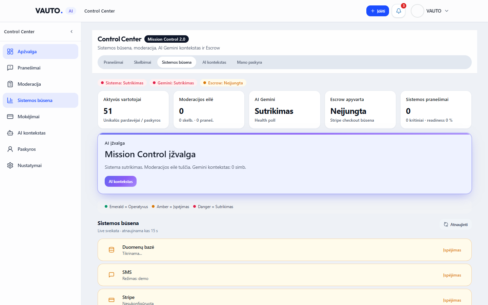
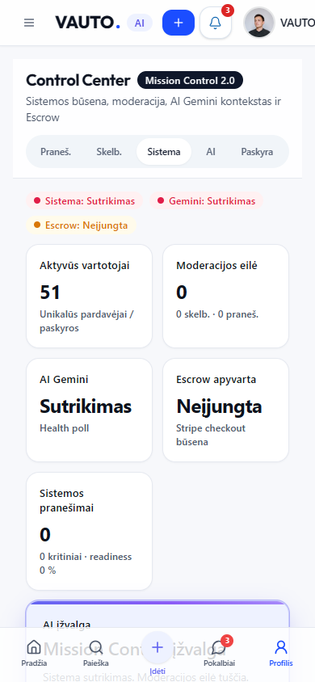

# VAUTO Premium UI 2.0 — Etapas 8: Control Center (Mission Control 2.0)

**Data:** 2026-08-05  
**Status:** Atlikta

## Santrauka

Administratoriaus Control Center atnaujintas į **Mission Control 2.0**: DS KPI juosta su sistemos statuso indikatoriais (Emerald / Amber / Danger), moderacijos rizikos kortelės, Gemini Context Inspector ir sujungimas su Etapas 2 Control Center sidebar.

## Pakeitimai

| Modulis | Kelias |
|---------|--------|
| Mission Overview KPI | `src/components/admin/AdminMissionOverview.tsx` |
| Admin shell | `src/components/admin/AdminProfileShell.tsx` |
| Moderacijos eilė | `src/components/admin/AdminListingModeration.tsx` |
| Gemini inspector | `src/components/admin/AdminGeminiUploadPanel.tsx` |
| Ops status rows | `src/components/admin/AdminOpsPanel.tsx` |
| Sidebar label | `src/components/app-shell/nav-config.ts` (Paskyros) |
| Playwright | `e2e/control-center-ui-8.0.spec.ts` |

**Neliečiama:** API, Auth, DB, moderacijos / kill-switch verslo logika (tik UI).

## KPI ir statusai

- StatCards: Aktyvūs vartotojai · Moderacijos eilė · AI Gemini (+ latency) · Escrow · Sistemos pranešimai
- Indikatoriai: Operatyvus (emerald) · Įspėjimas (amber) · Sutrikimas (danger)
- Moderacija: Risk Low/Medium/High Badge · Patvirtinti / Atmesti / Pažymėti AI patikrai
- Gemini: `AiInsightCard` + tamsaus fono kodo peržiūra

## Sidebar

Apžvalga · Pranešimai · Moderacija · Sistemos būsena · Mokėjimai · AI kontekstas · Paskyros · Nustatymai

## QA

| Check | Rezultatas |
|-------|------------|
| `npx tsc --noEmit` | Exit 0 |
| `npm run server:build` | Exit 0 |
| `npm run build` | Exit 0 |
| Playwright `e2e/control-center-ui-8.0.spec.ts` | **2/2 passed** |

## Screenshot’ai

### Desktop 1440×900

### Mobile 390×844

