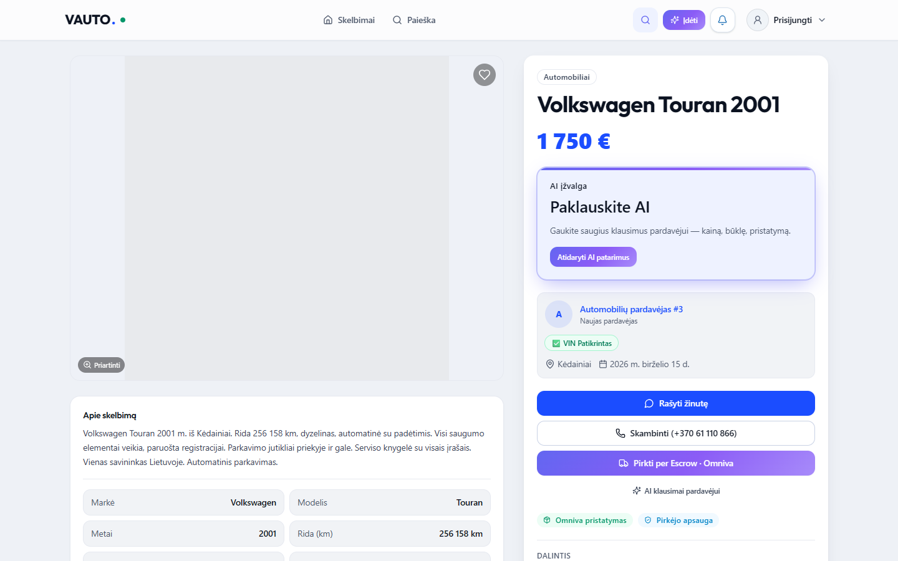
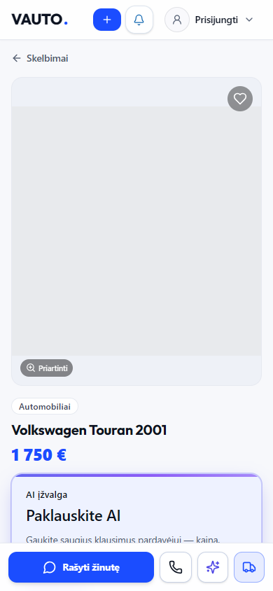

# VAUTO Premium UI 2.0 — Etapas 5: Skelbimo detalės (Listing Detail 2.0)

**Data:** 2026-08-05  
**Status:** Atlikta

## Santrauka

Pertvarkytas skelbimo detalės puslapis į premium marketplace layout: kairėje galerija, dešinėje sticky pirkėjo panelis, atskira savininko juosta, DS `AiInsightCard` kainos įžvalga, Omniva / pirkėjo apsaugos badge’ai ir ListingCard 2.0 panašiems skelbimams.

## Pakeitimai

| Modulis | Kelias |
|---------|--------|
| Listing Detail page | `src/components/ListingDetailPage.tsx` |
| Sticky pirkėjo panelis | `src/components/listing/ListingDetailStickyPanel.tsx` |
| Savininko režimo juosta | `src/components/listing/ListingDetailOwnerBar.tsx` |
| Panašūs skelbimai | `src/components/listing/SimilarListingsSection.tsx` |
| Galerija (desktop aukštis) | `src/components/listing/ListingImageGallery.tsx` |
| Playwright snapshots | `e2e/detail-ui-5.0.spec.ts` |

**Neliečiama:** API, Auth, Stripe Escrow, pokalbių kūrimas, DB, skelbimų valdymo / profilio puslapiai. CTA handleriai (`startChat`, `OrderWithShippingModal`, `markListingSold`, edit/hide) nepakeisti.

## Layout

- **Desktop:** `lg:grid-cols-12` — galerija + aprašymas / specs / vietovė (`col-span-7`), sticky elevated Card panelis (`col-span-5`)
- **Sticky panel:** pavadinimas, kaina, `AiInsightCard`, pardavėjo avataras + reitingas + atsako hintas, CTA (žinutė / skambutis / Escrow·Omniva), apsaugos badge’ai, dalijimasis
- **Savininko juosta:** Redaguoti, Statistika, AI Optimizuoti, Pažymėti parduotu, Paslėpti + promote / share
- **Mobile:** pavadinimas po galerija, sticky bottom bar; sticky panelis tik `lg+`

## QA

| Check | Rezultatas |
|-------|------------|
| `npx tsc --noEmit` | Exit 0 |
| `npm run server:build` | Exit 0 |
| `npm run build` | Exit 0 |
| Playwright `e2e/detail-ui-5.0.spec.ts` | **2/2 passed** |

## Screenshot’ai

