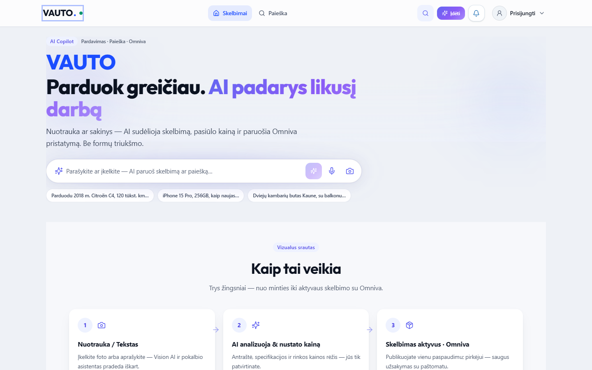
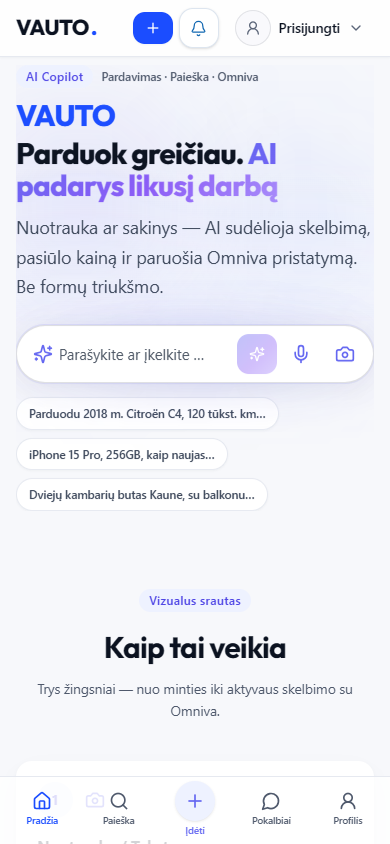

# VAUTO Premium UI 2.0 — Etapas 9: Final Polish & Audit

**Data:** 2026-08-05  
**Status:** Atlikta

## Santrauka

Uždarytas Premium UI 2.0 ciklas: mikroanimacijos (150–180 ms), glassmorphism, AI indigo glow/pulse, WCAG AA fokus-visible + reduced-motion, ir pilnas Etapų 1–9 Playwright auditas.

**Neliečiama:** API, Auth, Stripe, DB, backend logika.

## Etapo 9 pakeitimai

| Zona | Kelias |
|------|--------|
| Polish CSS | `src/design-system/polish.css` |
| Import | `src/app/globals.css` |
| Card lift / AI pulse | `src/design-system/primitives/Card.tsx` |
| Shimmer + AiInsightCard glow | `src/design-system/primitives/Feedback.tsx` |
| Modal blur + Escape menu | `src/design-system/primitives/Overlay.tsx` |
| Button motion | `src/design-system/primitives/Button.tsx` |
| Glass header / bottom nav | `AppHeader.tsx`, `MobileBottomNavigation.tsx` |
| AI copilot glow | `AiCommandBar.tsx`, `TopAiCommandChrome.tsx` |
| Muted contrast (AA) | `src/design-system/tokens.css` |
| Playwright | `e2e/polish-ui-9.0.spec.ts` |

### Mikroanimacijos & glass

- `--ds-duration-hover: 160ms`, `.ds-card-lift` (2px + `shadow-md`)
- `.ds-glass` / `.ds-glass-strong` (`backdrop-blur` 12–16px) ant sticky header, mobile bottom bar, AI chrome
- `.ds-shimmer` loading skeleton; `.ds-ai-glow` + `.ds-ai-pulse` ant AI kortelių / Copilot juostos
- Modal backdrop: `backdrop-blur-md`

### Accessibility

- Global `:focus-visible` ring + `.ds-focusable*`
- Modal / Dropdown `Escape` uždarymas
- `prefers-reduced-motion` → hover duration 0, no pulse/shimmer/lift
- Light muted `#4f596c`, dark muted `#9aa3b5` (WCAG AA vs surfaces)

### Cleanup

- Papildomas CSS sluoksnis tik `polish.css` (jokių senų dubliuotų UI CSS failų `src/` — tik `globals.css` + DS tokens/polish)

## QA išvestis

| Check | Rezultatas |
|-------|------------|
| `npx tsc --noEmit` | **Exit 0** |
| `npm run server:build` | **Exit 0** |
| `npm run build` | **Exit 0** |
| Playwright UI 1–9 (`--workers=1`) | **27/27 passed** |

### Playwright spekai

| Spec | Etapas | Status |
|------|--------|--------|
| `e2e/app-shell-nav.spec.ts` | 2 | 10/10 |
| `e2e/home-ui-3.0.spec.ts` | 3 | 2/2 |
| `e2e/market-ui-4.0.spec.ts` | 4 | 2/2 |
| `e2e/detail-ui-5.0.spec.ts` | 5 | 2/2 |
| `e2e/profile-ui-6.0.spec.ts` | 6 | 4/4 |
| `e2e/business-ui-7.0.spec.ts` | 7 | 2/2 |
| `e2e/control-center-ui-8.0.spec.ts` | 8 | 2/2 |
| `e2e/polish-ui-9.0.spec.ts` | 9 | 3/3 |

## 9 etapų realizacijos santrauka

| # | Etapas | Esminis rezultatas |
|---|--------|--------------------|
| 1 | Design System | Tokens, Button/Card/Badge/Modal/AiInsightCard, `/ui-kit` |
| 2 | App Shell | Sticky header, sidebar, mobile bottom nav, role chrome |
| 3 | Homepage | AI-first hero, Copilot juosta, visual flow |
| 4 | Marketplace | ListingCard 2.0 grid + filtrai |
| 5 | Listing Detail | Gallery + sticky buyer panel + similar |
| 6 | Mano skelbimai / Profilis | KPI StatCards, management cards, profile hero |
| 7 | Business Cockpit | Pro KPI/analytics, section nav |
| 8 | Control Center | Mission Control 2.0 KPI + moderation UI |
| 9 | Final polish | Motion, glass, a11y, full audit |

## Screenshotai

