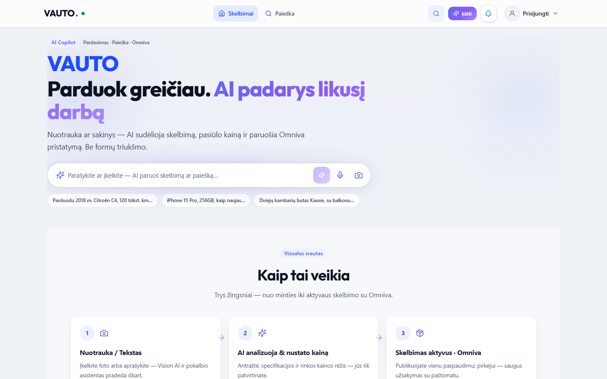
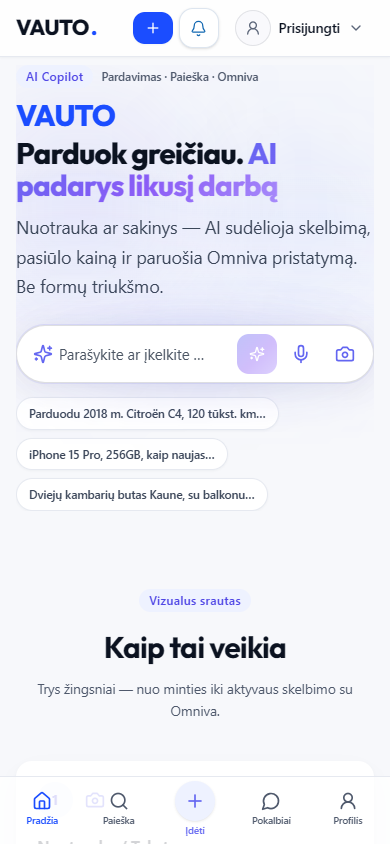

# VAUTO Premium UI 2.0 — Etapas 3: Homepage Redesign & AI Identity

**Data:** 2026-08-05  
**Status:** Atlikta

## Santrauka

Pradinis puslapis perorientuotas į AI-First onboarding: naujas hero teiginys, indigo Copilot juosta su chipais, 3 žingsnių vizualus srautas su `AiInsightCard`, ir DS vertės kortelės su hover lift.

## Pakeitimai

| Zona | Failas |
|------|--------|
| Hero + chips | `src/components/home/HomeAiHero.tsx` |
| Visual flow | `src/components/home/HomeVisualFlow.tsx` |
| Vertės kortelės | `src/components/home/HomeValuePropCards.tsx` |
| How-it-works (DS) | `src/components/ui/HowItWorksSection.tsx` |
| Copilot UI (Mic, glow) | `src/components/search/AiCommandBar.tsx` |
| Indigo focus CSS | `src/app/globals.css` |
| Homepage wiring | `src/app/page.tsx` |

**Neliečiama:** `ListingGrid`, listing detail, API / auth / paieškos semantika.

## Copy

- **Hero:** „Parduok greičiau. AI padarys likusį darbą“
- **Chips:** Citroën / iPhone 15 Pro / butas Kaune
- **Placeholder:** „Parašykite ar įkelkite — AI paruoš skelbimą ar paiešką…“

## QA

| Check | Rezultatas |
|-------|------------|
| `npx tsc --noEmit` | Exit 0 |
| `npm run server:build` | Exit 0 |
| `npm run build` | Exit 0 |
| Playwright `e2e/home-ui-3.0.spec.ts` | 2/2 passed |

## Screenshot’ai

