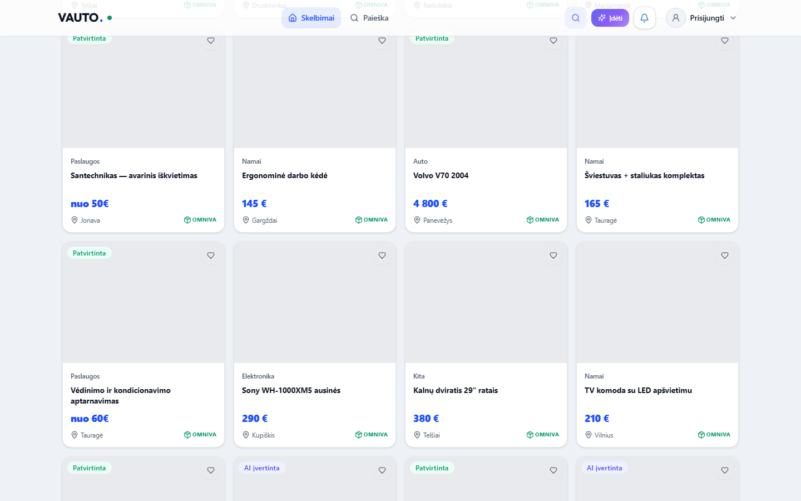
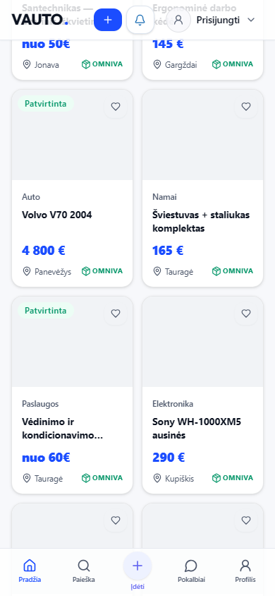

# VAUTO Premium UI 2.0 — Etapas 4: Marketplace katalogas & ListingCard 2.0

**Data:** 2026-08-05  
**Status:** Atlikta

## Santrauka

Suvienodintas marketplace feed į **ListingCard 2.0**, atnaujinta filtrų juosta su DS form controls + mobile drawer, o „Ieškoma…” spinnerį pakeitė pulsuojantis skeleton tinklelis.

## Pakeitimai

| Modulis | Kelias |
|---------|--------|
| ListingCard 2.0 | `src/components/marketplace/ListingCard.tsx` |
| Skeleton tinklelis | `src/components/marketplace/ListingCardSkeleton.tsx` |
| Legacy aliases | `src/components/marketplace/MarketplaceListingCards.tsx` |
| Filtrų juosta | `src/components/marketplace/MarketplaceFilterBar.tsx` |
| Grid wiring | `src/components/ListingGrid.tsx` |

**Neliečiama:** Listing Detail, seller wizard, API / search algoritmai.

## ListingCard 2.0 savybės

- Grid / list layout, aspect-[4/3], foto count badge, heart (IconButton)
- Žymos: Patvirtinta, AI kainos signalas (Gera kaina / Rinkos mediana / AI įvertinta), Omniva
- Hover: 180ms lift 2–3px + image scale-105
- Kategorija, pavadinimas, kaina, vieta

## Filtrai

- Desktop: kategorija, rikiavimas, vietovė, spindulys, kaina nuo/iki (DS `Select` / `Input`)
- Mobile: „Filtrai“ → Modal drawer + Taikyti / Išvalyti
- View mode: sąrašas / tinklelis / žemėlapis

## QA

| Check | Rezultatas |
|-------|------------|
| `npx tsc --noEmit` | Exit 0 |
| `npm run server:build` | Exit 0 |
| `npm run build` | Exit 0 |
| Playwright `e2e/market-ui-4.0.spec.ts` | **2/2 passed** |

## Screenshot’ai

