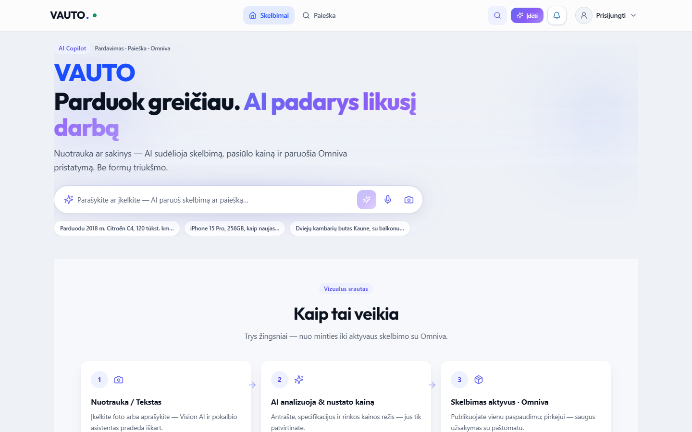
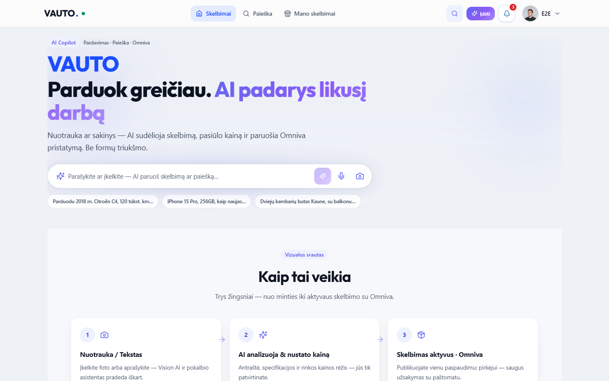
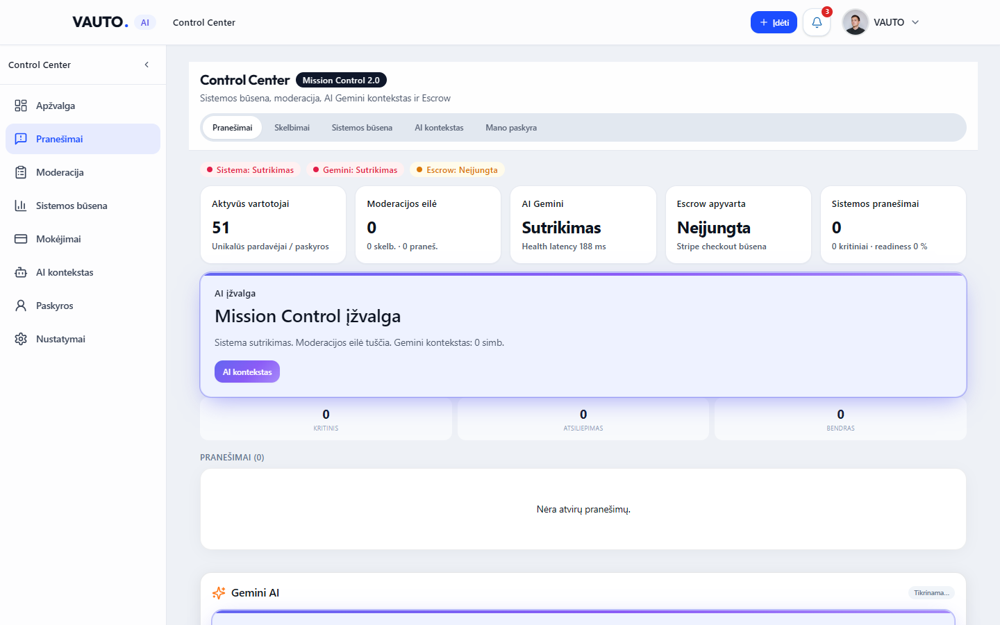
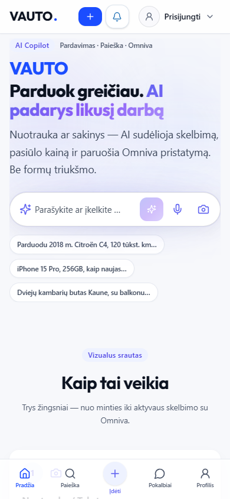
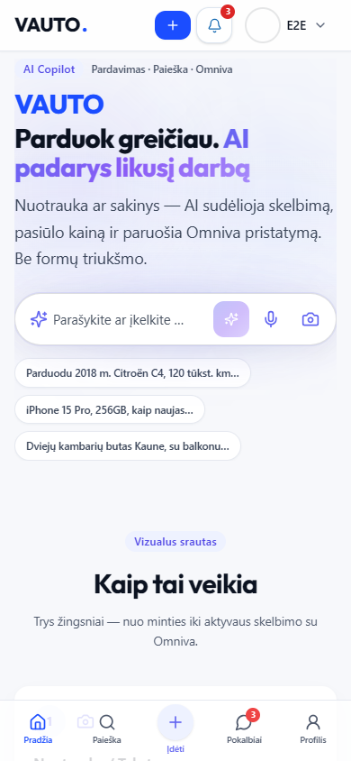
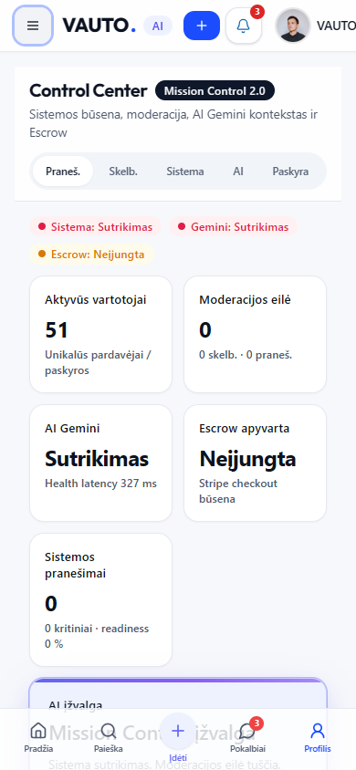

# VAUTO Premium UI 2.0 — Etapas 2: Navigation & App Shell

**Data:** 2026-08-05  
**Status:** Atlikta (lokaliai)

## Santrauka

Sukurta role-based App Shell 2.0 navigacija ant Design System 2.0 tokenų/komponentų. Marketplace naudoja viršutinį `AppHeader`, Verslas / Control Center — kairįjį `AppSidebar` (collapse + localStorage + mobile drawer), mobilusis — fiksuotą `MobileBottomNavigation`.

## Nauji / atnaujinti moduliai

| Modulis | Kelias |
|--------|--------|
| Nav config (persona / zona / CC / Verslas) | `src/components/app-shell/nav-config.ts` |
| AppHeader | `src/components/app-shell/AppHeader.tsx` |
| AppSidebar | `src/components/app-shell/AppSidebar.tsx` |
| MobileBottomNavigation | `src/components/app-shell/MobileBottomNavigation.tsx` |
| PageContainer + Breadcrumbs | `src/components/app-shell/PageContainer.tsx` |
| AppShell barrel | `src/components/app-shell/` |
| Adaptive wiring | `src/components/layout/VautoAdaptiveLayout.tsx` |
| CC wrap | `src/components/admin/AdminProfileShell.tsx` |
| Playwright | `e2e/app-shell-nav.spec.ts` |

## Role-based navigacija (tik realūs route’ai)

- **Guest:** Skelbimai, Paieška + bottom: Pradžia / Paieška / Įdėti / Pokalbiai / Profilis  
- **Buyer (private auth):** + Mano skelbimai  
- **Business:** + Verslui; sidebar `/verslui`, skelbimai, nustatymai  
- **Admin:** + Control Center; sidebar Apžvalga, Pranešimai, Moderacija, Sistemos būsena, Mokėjimai, AI, Paskyra, Nustatymai  

Neįtraukta (nėra veikiančio route): atskiri „Vartotojai“, „Leads“, „Planas“.

## QA

| Check | Rezultatas |
|-------|------------|
| `npx tsc --noEmit` | Exit 0 |
| `npm run server:build` | Exit 0 |
| `npm run build` | Exit 0 |
| `playwright e2e/app-shell-nav.spec.ts` | **10/10 passed** (guest / buyer / admin × 390 / 768 / 1440 + Escape) |

## Screenshot’ai

Katalogas: [`docs/ui-nav-2.0/`](./ui-nav-2.0/)

### Desktop (1440×900)

### Mobile (390×844)

### Tablet (768×1024)

- `guest-tablet.png`, `buyer-tablet.png`, `admin-cc-tablet.png`

## Pastabos

- API / auth / routing semantika / homepage hero turinys (tekstas, AI juosta) nepakeisti — pašalintas tik dubliuojantis in-page `Header` (dabar no-op), nes chrome valdo `AppHeader`.
- Legacy `BottomNav` / `DesktopHeader` lieka faile, bet adaptive layout naudoja App Shell 2.0.
