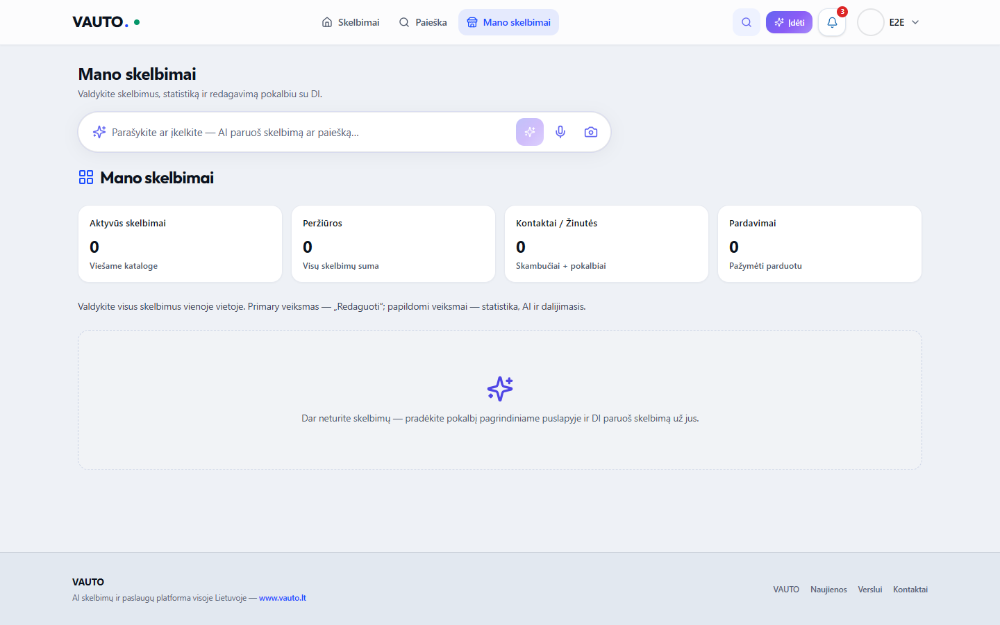
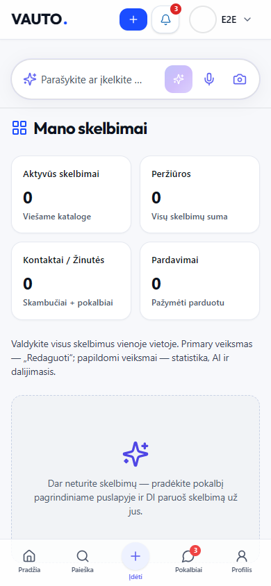
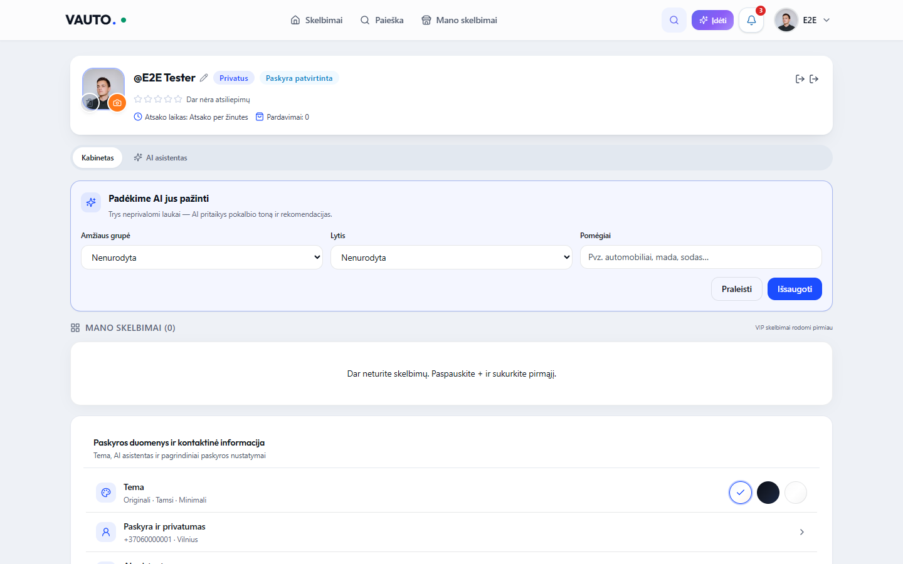
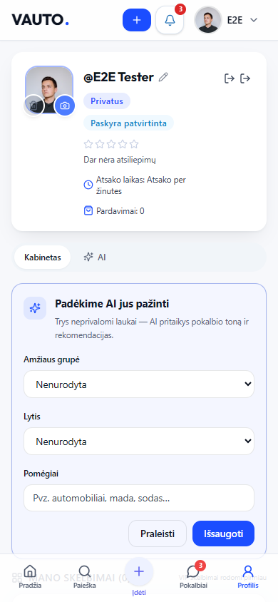

# VAUTO Premium UI 2.0 — Etapas 6: Mano skelbimai & Profilis

**Data:** 2026-08-05  
**Status:** Atlikta

## Santrauka

Atnaujinti **Mano skelbimai** (KPI `StatCard` juosta + Listing Management Card su mygtukų hierarchija) ir **Profilis** (Pardavėjo Hero + sugrupuotos DS Card nustatymų sekcijos). Verslo portalas / Control Center neliesti.

## Pakeitimai

| Modulis | Kelias |
|---------|--------|
| Mano skelbimai dashboard | `src/components/dashboard/ManoSkelbimaiDashboard.tsx` |
| Listing Management Card | `src/components/dashboard/ListingManagementCard.tsx` |
| Profile Hero | `src/components/profile/ProfileHeader.tsx` |
| Profilio nustatymų meniu | `src/components/profile/ProfileSettingsMenu.tsx` |
| Nustatymų puslapio sekcijos | `src/app/profile/settings/page.tsx` |
| Playwright | `e2e/profile-ui-6.0.spec.ts` |

**Neliečiama:** API, Auth, DB, būsenų / paskyros verslo logika (tik esamų handlerių prijungimas UI).

## Mano skelbimai

- KPI: Aktyvūs · Peržiūros · Kontaktai / Žinutės · Pardavimai
- Kortelė: nuotrauka, kaina, būsenos badge (Aktyvus / Juodraštis / Parduotas), AI rekomendacija
- Primary **Redaguoti** · Secondary **Statistika / AI Optimizuoti / Dalintis** · Overflow **Pažymėti parduotu / Slėpti / Ištrinti**

## Profilis

- Hero: avataras, niką, patvirtinimo badge, ★★★★★, atsako laikas, pardavimų skaičius
- Nustatymų Card sekcijos: paskyra · pranešimai · saugumas · mokėjimai · narystė

## QA

| Check | Rezultatas |
|-------|------------|
| `npx tsc --noEmit` | Exit 0 |
| `npm run server:build` | Exit 0 |
| `npm run build` | Exit 0 |
| Playwright `e2e/profile-ui-6.0.spec.ts` | **4/4 passed** |

## Screenshot’ai

### Mano skelbimai — Desktop

### Mano skelbimai — Mobile

### Profilis — Desktop

### Profilis — Mobile

